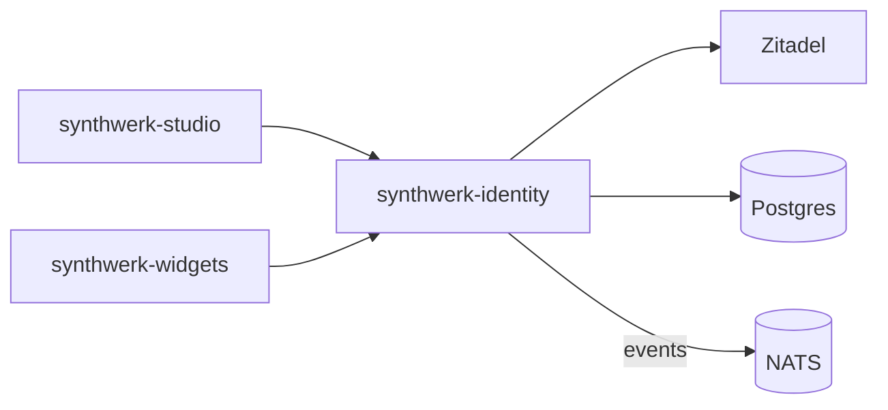

# synthwerk-identity

**Synthwerk** · orgs, roles, entitlements and paywall on top of Zitadel

## In 30 seconds

- Owns organisations, roles, entitlements and the paywall. Zitadel v4 does the login (OIDC, passkeys, MFA).
- Studio, widgets and SDK apps call it. It emits identity events on the NATS bus.
- It turns Stripe events into one entitlements table.

## Where it fits

- Ecosystem map: [synthwerk](https://github.com/VelimirMueller/synthwerk).
- Shared CI, lint configs and templates: [synthwerk-blueprint](https://github.com/VelimirMueller/synthwerk-blueprint).

## Status

| Item | State |
|---|---|
| Rewrite | Planned in epic **E2 Identity** |
| Old code | Tag [`legacy-final`](../../tree/legacy-final): a Kotlin/Quarkus prototype (hard-coded users, no tokens) |
| Branching | `main` deploys to dev, a `vX.Y.Z` tag to stg, an approved digest to prd |

- This repo was renamed. The old URL still redirects here.
