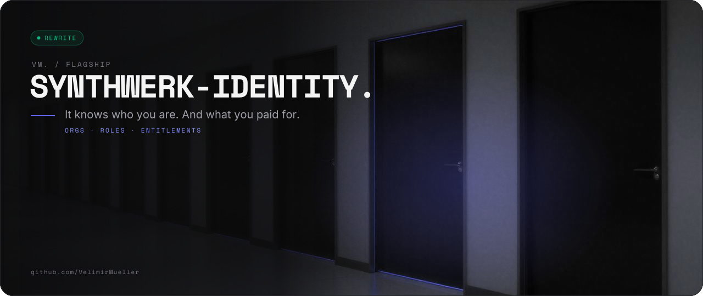
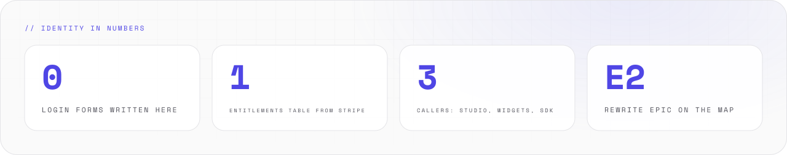
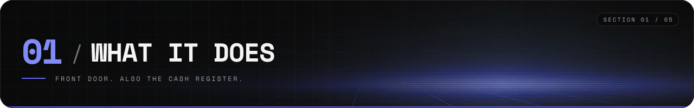
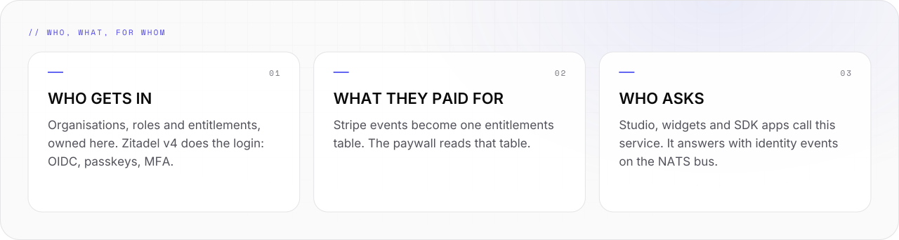
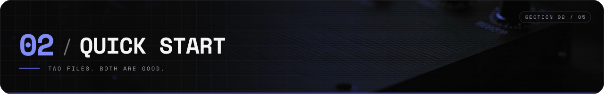
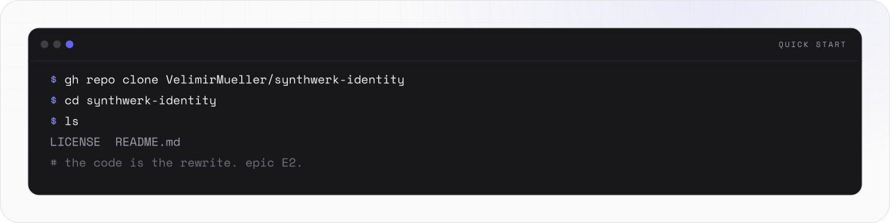
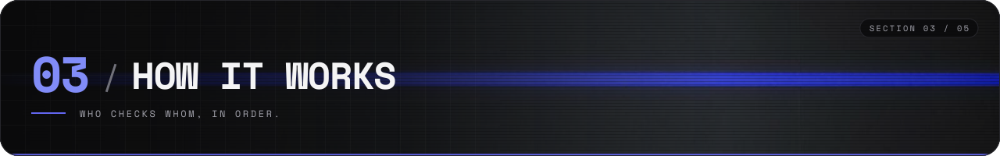
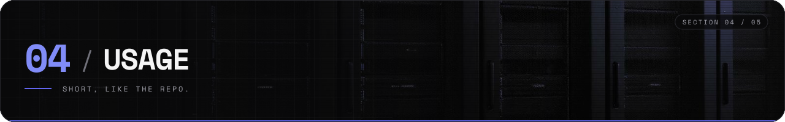
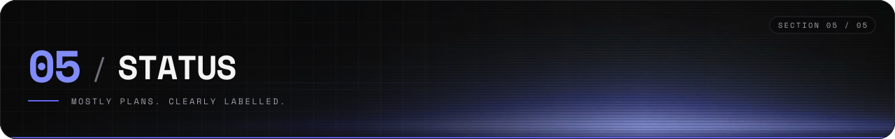
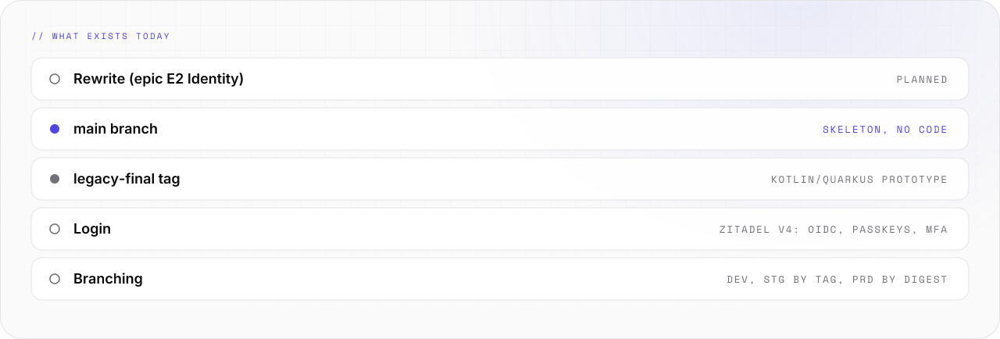

<picture>
  <source media="(prefers-color-scheme: light)" srcset="assets/banner/hero-v2-light.svg">
  
</picture>

<p align="center">

[](#-05-status) [](https://github.com/VelimirMueller) [](#-05-status) [](LICENSE)

</p>

> It knows who you are. And what you paid for.

```text
 █████  ██  ██  ██  ██  ██████  ██  ██  ██   ██  ██████  █████   ██  ██
██      ██  ██  ███ ██    ██    ██  ██  ██   ██  ██      ██  ██  ██ ██
 ████    ████   ██████    ██    ██████  ██ █ ██  █████   █████   ████    █████
    ██    ██    ██ ███    ██    ██  ██  ███████  ██      ██ ██   ██ ██
█████     ██    ██  ██    ██    ██  ██   ██ ██   ██████  ██  ██  ██  ██
██████  █████   ██████  ██  ██  ██████  ██████  ██████  ██  ██
  ██    ██  ██  ██      ███ ██    ██      ██      ██    ██  ██
  ██    ██  ██  █████   ██████    ██      ██      ██     ████
  ██    ██  ██  ██      ██ ███    ██      ██      ██      ██
██████  █████   ██████  ██  ██    ██    ██████    ██      ██    ██

 ------  orgs · roles · entitlements · paywall --------------------------
```

**synthwerk-identity** owns organisations, roles, entitlements and the paywall for the synthwerk services.
Zitadel says who you are. This service decides what that is worth.

<picture>
  <source media="(prefers-color-scheme: dark)" srcset="assets/readme/stats-v2-dark.svg">
  
</picture>

<br>

## // 01 WHAT IT DOES



<picture>
  <source media="(prefers-color-scheme: dark)" srcset="assets/readme/features-v2-dark.svg">
  
</picture>

- Owns organisations, roles and entitlements for every synthwerk service.
- Zitadel v4 does the login: OIDC, passkeys, MFA. No login form lives here.
- Turns Stripe events into one entitlements table. The paywall reads that table.
- Emits identity events on the NATS bus. The other services trust them.

<br>

## // 02 QUICK START



<picture>
  <source media="(prefers-color-scheme: dark)" srcset="assets/readme/start-v2-dark.svg">
  
</picture>

```bash
gh repo clone VelimirMueller/synthwerk-identity
cd synthwerk-identity
ls
```

- Output: `LICENSE  README.md`. That is the whole tree.
- No service runs from this repo yet. `main` carries the Synthwerk skeleton.
- The rewrite is epic **E2 Identity**, planned on the [synthwerk map](https://github.com/VelimirMueller/synthwerk).

<br>

## // 03 HOW IT WORKS



<picture>
  <source media="(prefers-color-scheme: dark)" srcset="assets/readme/flow-v2-dark.svg">
   IDENTITY -> ZITADEL V4 -> POSTGRES · NATS. Stripe webhooks come in. One entitlements table comes out." src="assets/readme/flow-v2-light.svg" width="100%">
</picture>

```text
 studio ──┐
 widgets ─┼──> identity ──> Zitadel v4 (OIDC, passkeys, MFA)
 sdk ─────┘       │
                  ├──> Postgres (orgs, roles, entitlements)
                  └──> NATS bus (identity events)

 stripe events ──> one entitlements table ──> the paywall
```

- Clients are synthwerk-studio, synthwerk-widgets and the SDK apps. They ask, identity answers.
- The rewrite targets Go 1.27.

<br>

## // 04 USAGE



### Where it fits

- Ecosystem map: [synthwerk](https://github.com/VelimirMueller/synthwerk). One repo per role. Start there.
- Shared CI, lint configs and templates: [synthwerk-blueprint](https://github.com/VelimirMueller/synthwerk-blueprint).
- This repo was renamed. The old URL still redirects here.

### Legacy code

- The tag [`legacy-final`](../../tree/legacy-final) keeps the old service: a Kotlin/Quarkus prototype with hard-coded users and no tokens.
- Branching, when the code returns: `main` deploys to dev, a `vX.Y.Z` tag to stg, an approved digest to prd.

<br>

## // 05 STATUS



<picture>
  <source media="(prefers-color-scheme: dark)" srcset="assets/readme/status-v2-dark.svg">
  
</picture>

```text
[ STATUS ]  rewrite planned, epic E2 identity
[ WORKS   ]  the README. the LICENSE.
[ NEXT    ]  the service itself, in Go
```

No test command yet. No CHANGELOG yet. There is no code to test.
When the rewrite lands, this section gets honest numbers.

<br>

```text
-- EOF ------------------------------------ ACCESS GRANTED, EVENTUALLY --
```

---

<sub>VM. studio / flagship · open source · look per <code>vm-brand</code> playbook · [MIT](LICENSE) © 2025 Velimir Müller</sub>
